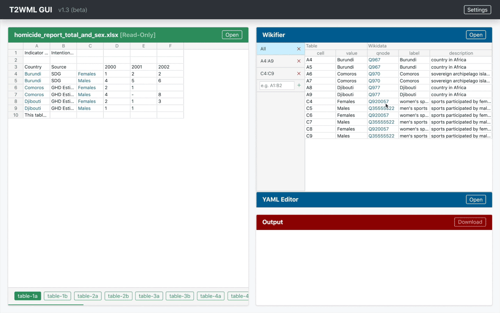

# T2WML: A Cell-Based Language To Map Tables Into Wikidata Records

* [The T2WML standalone local server](#server)
* [The T2WML programming API](#api)
* [Running T2WML for development](#development)
* [Usage with GUI](#usage_with_gui)
* [Writing T2WML](#writing_t2wml)
* [Features](#features)
* [FAQs](#faqs)

<table>
  <tr><td><b>Operating system:</b></td><td>macOS / OS X, Linux, Windows</td></tr>
  <tr><td><b>Python version:</b></td><td>Python 3.6+</td></tr>
</table>


## The T2WML standalone local server
<span id="server"></span>

A locally hosted web GUI version of t2wml can be installed quickly using pip

1. make a fresh virtual environment
2. `pip install --extra-index-url https://pypi.fury.io/theresearchsoftwarecompany/ t2wml-standalone==2.0a17`
3. run `t2wml-server`
4. navigate to [`http://localhost:13000/`](http://localhost:13000/) in a Chrome browser


## The T2WML programming API
<span id="api"></span>

You can write your own code using the T2WML programming API

1. make a fresh virtual environment
2. `pip install --extra-index-url https://pypi.fury.io/theresearchsoftwarecompany/ t2wml-api`
3. You can now use `from t2wml import...` to write code (see the [API guide](t2wml-api/API.md))


## Running T2WML for development
<span id="development"></span>

1. Clone the repository
2. Create a virtual environment
3. Install the t2wml API (optional: in editable mode with the -e flag)
	`pip install t2wml-api` or `pip install -e t2wml-api`
	
	On Windows you may encounter an error saying that `etk.wikidata` cannot be imported when you run the backend.
    If you encounter it, run:

    `pip install --force-reinstall etk`
4. Install the remaining requirements from server/requirements.txt
   `pip install -r server\requirements.txt`

5. In the folder server/backend, run the backend server: 
    `python application.py`
6. Install the frontend requirements:
   In the folder "frontend", run `npm install`
7. Run the frontend server: 
   In the folder "frontend", run `npm run start`

The backend will be running on port 13000, and the frontend on port 3000. Navigate to [`http://localhost:3000/`](http://localhost:3000/) on a Chrome browser to begin using.

The repo also contains vscode configurations for the convenience of those working in VS Code.


## Usage with GUI
<span id="usage_with_gui"></span>

1. Open the GUI
2. In **Table Viewer**,
	1. click **Upload** to open a table file (.csv/.xls/.xlsx)
3. In **Wikifier**,
	1. define and wikify the regions you need [[demo](#wikify_region)], and/or
	2. click **Upload** to open a wikifier file (.csv)
	3. correct mismatched qnode if necessary [[demo](#modify_qnode)]
4. In **YAML Editor**,
	1. type/paste in T2WML code, or
	2. click **Upload** to open a YAML file (.yaml)
	3. click **Apply** to highlight some regions in **Table Viewer**
5. In **Output**,
	1. preview result by clicking cell in **Table Viewer** [[demo](#preview_result)], or
	2. click **Download** to get all results


## Writing T2WML
<span id="writing_t2wml"></span>

Check out the [grammar guide](docs/grammar.md)


## Features
<span id="features"></span>

> Note: All screenshots below are captured in GUI v1.3. Minor inconsistencies may appear.

<span id="wikify_region"></span>⬇️ Wikify region


<span id="modify_qnode"></span>⬇️ Modify qnode


<span id="preview_result"></span>⬇️ Preview result


## FAQs
<span id="faqs"></span>

* **Installation failed due to `etk`?**

    Run the following commands in terminal/cmd:
    ```
    pip uninstall etk
    pip install https://github.com/usc-isi-i2/etk/archive/development.zip
    ```

* **Login failed or encountered an authentication error like `400 (OAuth2 Error)`?**
  
    Access T2WML at `http://localhost:13000/` instead of `http://127.0.0.1:13000`.

* **Error saying can't find static/index.html?**
  
    Make sure you install t2wml-standalone in a folder that does not contain the T2WML repo or there will be a configurations clash.

* **Encountered any other error not mentioned in the FAQs?**
  
    Post the issue in the T2WML repository along with a detailed description.
